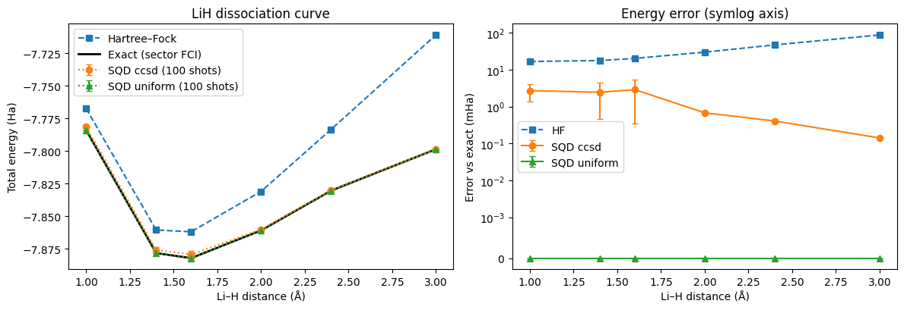
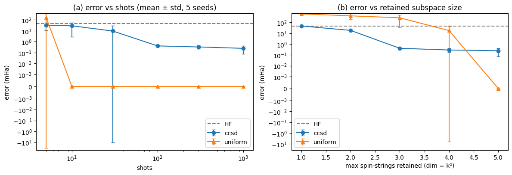

# Estimate molecular energies with sample-based quantum diagonalization
https://github.com/user-attachments/assets/d8957230-1f38-42c6-a9b2-db33aeda6028

QiskChem / BasQ Qiskit Fall Fest 2026 challenge. Pipeline: **Molecule → trial circuit → measured configurations → selected subspace → classical diagonalization → energy.**

## TL;DR

- **Problem.** How accurately can a *limited number of quantum-circuit samples* and a *small classical subspace* estimate a molecule's ground-state energy, and what does it cost? Model: neutral LiH, STO-3G, frozen core, 2 electrons in 5 orbitals (10 qubits, 25 determinants), at six bond lengths from 1.0 to 3.0 Å.
- **Method.** A UCCSD circuit seeded with classical CCSD amplitudes (no optimisation, no use of the exact ground state) is sampled with finite shots. Valid configurations form an α×β determinant subspace; its projected Hamiltonian (with off-diagonal elements) is diagonalised with `qiskit-addon-sqd`. We compare against Hartree–Fock, the exact sector energy, a **uniform-random configuration baseline** with the same subspace rules, and **VQE** with full cost accounting.
- **Results.**
  - SQD cuts the Hartree–Fock error from 47 mHa to **0.41 mHa** at 2.4 Å using about 100 shots and a 9-dimensional subspace (full sector: 25).
  - At equal shots the **uniform baseline wins**: it hits the whole sector within about 10 shots and returns the exact energy. This sector is too small for a sampling advantage.
  - At equal *solve dimension* the circuit samples are far better (0.41 vs 269 mHa at dimension 9).
  - VQE reaches the exact energy but needs 1,200–3,000 energy evaluations per geometry. Optimised VQE parameters give no SQD benefit over the free CCSD seeds.
- **Not claimed:** quantum advantage. All sampling is on a noiseless simulator.

Contents:
[1 Problem](#1-problem)
· [2 Methods](#2-methods)
· [3 Data](#3-data)
· [4 Setup and run](#4-setup-and-run-steps)
· [5 Experiments](#5-experiments)
· [6 Results](#6-results)
· [7 Common questions](#7-common-questions-from-the-brief-answered-with-our-results)
· [8 Limitations](#8-limitations)
· [9 Conclusions](#9-conclusions)
· [10 Layout](#10-repository-layout)
· [11 Credits](#11-credits-and-licence)

## 1. Problem

Find the ground-state energy of **neutral LiH** (charge 0, spin 0, closed shell) in the **STO-3G** basis.

| Item | Choice |
|---|---|
| Geometry / units | Li at origin, H along z; distances in **ångström**: 1.0, 1.4, 1.6, 2.0, 2.4, 3.0 |
| Orbitals | RHF canonical orbitals (6 spatial: Li 1s, 2s, 2p×3, H 1s) |
| Frozen orbitals | Lowest orbital (≈ Li 1s), kept doubly occupied |
| Active space | **2 electrons in 5 spatial orbitals** (1 α + 1 β) = 10 spin orbitals = **10 qubits** |
| Sector size | 5 × 5 = **25 determinants** |
| Offsets | `ecore` from PySCF CASCI = nuclear repulsion + frozen-core energy, added **once** |
| Mapping / bit order | Jordan–Wigner, occupation encoding. Qubit *k*<5 = α orbital *k*; qubit 5+*k* = β orbital *k*. Qiskit prints qubit 0 on the right, so a bitstring reads `[β4…β0][α4…α0]` |
| References | **Hartree–Fock** and **exact** energy of the same finite Hamiltonian in the (1α,1β) sector (PySCF FCI, cross-checked against the qubit Hamiltonian to 1e-8 Ha). "Exact" means exact for this model, not an experimental energy |

All energies are total energies in hartree (Ha); errors are in millihartree (mHa), relative to the exact energy.

## 2. Methods

1. **Chemistry.** PySCF builds the active-space integrals `h1`, `h2` and `ecore`. Qiskit Nature builds the qubit Hamiltonian for cross-checks and VQE.
2. **Trial circuit (SQD).** Hartree–Fock state + **UCCSD** (24 parameters) whose angles are set from **classical CCSD amplitudes** on the same frozen/active orbitals. **No optimisation**; the exact ground state is never used. CCSD time is logged as classical preprocessing.
3. **Sampling.** Finite-shot computational-basis measurement on Qiskit Aer with fixed seeds. The circuit is transpiled to `{cx, rz, sx, x}` to report depth and two-qubit gates.
4. **Subspace construction** (identical for quantum and random samples):
   - split each bitstring into β (left) and α (right) halves;
   - **invalid** α/β electron counts are **discarded** and counted (no recovery in the core study);
   - **duplicates** merged, frequencies kept, strings ranked by frequency;
   - optional cap `max_strings` keeps the most frequent strings;
   - optional `include_hf` always adds the HF determinant (off in all experiments);
   - an **empty batch** gives no energy (`NaN`);
   - closed-shell symmetrisation pools α and β strings, so **solve dimension = (number of strings)²**.
5. **Diagonalisation.** `qiskit_addon_sqd.fermion.solve_fermion` builds the full projected Hamiltonian including off-diagonal elements and returns its lowest eigenvalue. We check it against an independent hand-built projection of the qubit Hamiltonian (agreement ≈ 1e-8 Ha) and assert the variational bound.
6. **Random baseline.** α and β strings drawn uniformly from the valid ones (each of the 25 configurations equally likely) and passed through the same subspace code.
7. **VQE (comparison).** Same UCCSD circuit, COBYLA from the HF point (all angles 0). Expectation values are exact statevector values, so VQE cost is reported as energy-evaluation counts plus a hypothetical shot estimate (58 commuting Pauli groups × 1000 shots per evaluation).

## 3. Data

No external dataset: everything is generated by the code.

- **Molecules:** the geometry grid above, defined in notebook Step 1.
- **Samples:** generated on the fly from the circuit with fixed seeds (`SEEDS = [0,1,2,3,4]`; the random baseline uses seeds `1000 + seed`).
- **Costs:** every CCSD run, transpile, sampling batch, solve and VQE optimisation is logged in a ledger (notebook Step 8).

## 4. Setup and run steps

**Requirements:** Python 3.10–3.12. **PySCF has no native Windows wheels**: use Linux, macOS, WSL2 (recommended on Windows) or Google Colab.

**A. Notebook (reproduces every experiment), Google Colab**

1. Upload `LiH_SQD_VQE.ipynb` to Colab.
2. Run all cells (the first cell installs the packages). Total runtime is about 4 minutes, mostly VQE.

**B. Local / WSL2**

```bash
python3 -m venv .venv && source .venv/bin/activate
pip install -r requirements.txt
jupyter notebook LiH_SQD_VQE.ipynb
```

**C. Web app (any closed-shell molecule, up to 14 qubits)**

```bash
cd qchem-app
python app.py            # open http://127.0.0.1:5000
```

Enter geometry (Å), charge, basis, frozen core and active orbitals, pick SQD or VQE, then **Run**. An IBM hardware option exists (`IBM_TOKEN` environment variable, or paste a token into the UI per request). It is **untested on a real device**, and no result in this repository comes from hardware. **Never commit an API token**; rotate any token that was committed or shared.

## 5. Experiments

Five seeds (0–4) unless stated. Tables and plots below come from the executed notebook in this repo.

| # | Experiment | Setup |
|---|---|---|
| 1 | Energy vs bond length | 6 geometries, 100 shots, CCSD-seeded circuit vs uniform baseline vs HF vs exact |
| 2 | Shots budget | 2.4 Å, shots ∈ {5, 10, 30, 100, 300, 1000}, no string cap |
| 3 | Subspace-size budget | 2.4 Å, 1000 shots, `max_strings` ∈ {1…5} (dimension 1, 4, 9, 16, 25) |
| 4 | VQE comparison | all geometries, UCCSD + COBYLA, exact expectation values |
| 5 | **Design choice:** which parameters drive the same UCCSD circuit? | 2.4 Å, 30 and 100 shots: CCSD-seeded vs VQE-trained vs random-angle vs uniform (no circuit) |

## 6. Results

### 6.1 Energy vs bond length (100 shots, 5 seeds)

Errors are mean ± std over seeds. "Distinct" = distinct valid full configurations; "dim" = actual solve dimension (full sector = 25).

| R (Å) | E_HF (Ha) | E_exact (Ha) | HF err (mHa) | SQD circuit err (mHa) | circuit distinct / dim | SQD uniform err (mHa) | uniform distinct / dim |
|---|---|---|---|---|---|---|---|
| 1.0 | -7.76736 | -7.78402 | 16.66 | 2.71 ± 1.32 | 2.8 / 8.0 | 0.00 ± 0.00 | 24.8 / 25 |
| 1.4 | -7.86054 | -7.87823 | 17.69 | 2.44 ± 1.98 | 3.2 / 9.4 | 0.00 ± 0.00 | 24.8 / 25 |
| 1.6 | -7.86186 | -7.88210 | 20.23 | 2.88 ± 2.54 | 3.0 / 7.0 | 0.00 ± 0.00 | 24.8 / 25 |
| 2.0 | -7.83091 | -7.86083 | 29.92 | 0.68 ± 0.00 | 3.8 / 9.0 | 0.00 ± 0.00 | 24.8 / 25 |
| 2.4 | -7.78338 | -7.83034 | 46.96 | 0.41 ± 0.00 | 6.6 / 9.0 | 0.00 ± 0.00 | 24.8 / 25 |
| 3.0 | -7.71083 | -7.79850 | 87.67 | 0.14 ± 0.00 | 7.2 / 9.0 | 0.00 ± 0.00 | 24.8 / 25 |



The correlation energy (HF error) grows with stretch, as expected for a closed-shell reference. SQD with the circuit samples beats HF at every geometry. The uniform baseline recovers the exact energy at every geometry because 100 shots cover the whole 25-determinant sector.

### 6.2 Error vs budget at 2.4 Å

**(a) Shots** (no string cap; HF error 46.96 mHa)

| Shots | circuit err (mHa) | circuit distinct / dim | uniform err (mHa) | uniform distinct / dim |
|---|---|---|---|---|
| 5 | 31.93 ± 21.54 | 1.6 / 3.2 | 164.64 ± 197.84 | 4.2 / 15.0 |
| 10 | 27.95 ± 25.16 | 2.0 / 4.8 | 0.00 ± 0.00 | 8.2 / 25 |
| 30 | 9.33 ± 19.96 | 3.4 / 8.0 | 0.00 ± 0.00 | 18.0 / 25 |
| 100 | 0.41 ± 0.00 | 6.6 / 9.0 | 0.00 ± 0.00 | 24.8 / 25 |
| 300 | 0.32 ± 0.11 | 7.2 / 11.8 | 0.00 ± 0.00 | 25 / 25 |
| 1000 | 0.24 ± 0.17 | 8.2 / 15.0 | 0.00 ± 0.00 | 25 / 25 |

**(b) Retained subspace size** (1000 shots; `max_strings` = k, dimension ≈ k²)

| k | dim (circuit / uniform) | circuit err (mHa) | uniform err (mHa) |
|---|---|---|---|
| 1 | 1 / 1 | 46.96 ± 0.00 | 613.88 ± 32.55 |
| 2 | 4 / 4 | 18.38 ± 0.00 | 403.69 ± 209.44 |
| 3 | 9 / 9 | 0.41 ± 0.00 | 268.58 ± 233.32 |
| 4 | 13.2 / 16 | 0.28 ± 0.11 | 17.61 ± 23.84 |
| 5 | 15.0 / 25 | 0.24 ± 0.17 | 0.00 ± 0.00 |



- At equal shots, uniform sampling wins once it has about 10 shots. At 5 shots its error is huge and variable (164.6 ± 197.8 mHa).
- At equal solve dimension the circuit samples win by one to two orders of magnitude. The circuit concentrates on the HF determinant (88% of the weight) and its dominant excitations, so it is a good **selector**; it is a poor **explorer**.
- Independent sampling runs are not nested, so error is not monotone in shots. At 30 shots the circuit gives 9.33 ± 19.96 mHa, because some seeds find only the HF string (46.96 mHa) and others find a useful subspace.

### 6.3 VQE comparison (UCCSD, COBYLA, exact expectation values)

| R (Å) | VQE err (mHa) | CCSD-seeded circuit ⟨H⟩ err (mHa) | HF err (mHa) | energy evals | opt. time (s) | hypothetical shots |
|---|---|---|---|---|---|---|
| 1.0 | 0.000 | 1.34 | 16.66 | 1188 | 17.7 | 6.9e7 |
| 1.4 | 0.000 | 1.76 | 17.69 | 1198 | 18.0 | 6.9e7 |
| 1.6 | 0.000 | 2.27 | 20.23 | 1223 | 18.4 | 7.1e7 |
| 2.0 | 0.000 | 5.04 | 29.92 | 1328 | 19.9 | 7.7e7 |
| 2.4 | 0.000 | 14.39 | 46.96 | 1772 | 26.7 | 1.0e8 |
| 3.0 | 0.000 | 52.74 | 87.67 | 3000 (cap hit) | 46.7 | 1.7e8 |

VQE reaches the exact sector energy (0.000 mHa to the printed precision, i.e. below 5e-6 mHa) at every geometry, including 3.0 Å where the 3000-evaluation cap was reached. The hypothetical shot count assumes 58 Pauli groups × 1000 shots per evaluation; it is an estimate, not a measurement.

### 6.4 Design comparison: which parameters drive the same UCCSD circuit? (2.4 Å, 5 seeds)

| Shots | Trial circuit | err (mHa) | distinct / dim | weight on HF |
|---|---|---|---|---|
| 30 | CCSD-seeded | 9.33 ± 19.96 | 3.4 / 8.0 | 0.89 |
| 30 | VQE-trained | 9.33 ± 19.96 | 3.4 / 8.0 | 0.89 |
| 30 | random-angle | 378.20 ± 0.00 | 5.0 / 16.0 | 0.00 |
| 30 | uniform (no circuit) | 0.00 ± 0.00 | 18.0 / 25 | n/a |
| 100 | CCSD-seeded | 0.41 ± 0.00 | 6.6 / 9.0 | 0.87 |
| 100 | VQE-trained | 0.41 ± 0.00 | 6.2 / 9.0 | 0.88 |
| 100 | random-angle | 302.56 ± 169.14 | 7.8 / 17.8 | 0.00 |
| 100 | uniform (no circuit) | 0.00 ± 0.00 | 24.8 / 25 | n/a |

Exact-state properties of the three circuits: P(HF) = 0.881 (CCSD-seeded), 0.888 (VQE-trained), 0.000 (random-angle); ⟨H⟩ error 14.39, 0.00 and 586.7 mHa.

**Reading:** optimisation improves the *energy of the prepared state* (14.4 → 0.0 mHa) but not the *configurations it proposes*, so the SQD accuracy is the same. The VQE-trained parameters add about 1,800 evaluations of cost for no SQD gain. A random-angle circuit is much worse than both, and also worse than uniform sampling, so "random angles" is not the same as "uniform baseline".

### 6.5 Cost accounting

Totals for the whole notebook run (`LEDGER`):

| Stage | Calls | Time (s) | Shots / evals |
|---|---|---|---|
| classical CCSD preprocessing | 6 | 0.26 | n/a |
| transpilation | 8 | 0.14 | n/a |
| circuit sampling (all batches, seeds and repeats) | 117 | 2.86 | **38,475 shots** |
| SQD projected solves | 211 | 0.75 | n/a |
| VQE optimisation | 6 | 147.3 | 9,709 evaluations (≈ 5.6e8 hypothetical shots) |

Compiled circuits (`{cx, rz, sx, x}`, 10 qubits):

| Circuit | Depth | Two-qubit gates | Total gates |
|---|---|---|---|
| CCSD-seeded UCCSD | 730 | 576 | 1005 |
| VQE-trained / random-angle UCCSD | 1940 | 1520 | 2601 |

The logical ansatz is identical. The CCSD circuit compiles smaller because the transpiler removes rotations whose angles are exactly zero by symmetry. For a single SQD run, the total cost is one circuit sampled for the stated shots, one CCSD calculation (about 0.04 s) and one solve of a few milliseconds.

### 6.6 Beyond the core study (web app)

- LiH 2.4 Å, SQD, 300 shots: 0.406 mHa error at solve dimension 9 (7 distinct configurations).
- H₂O / STO-3G, frozen core, 12 qubits, 225 determinants, 2000 shots: **1.04 mHa** error at solve dimension 81, versus 51 mHa for HF. This is a genuinely truncated subspace. No uniform baseline was run on H₂O, so it demonstrates the workflow rather than a comparison.

## 7. Common questions (from the brief), answered with our results


Model: LiH, STO-3G, frozen core (1 orbital), 2 electrons in 5 spatial orbitals = 10 qubits, 25 determinants. Energies are total energies in hartree (Ha); errors are in millihartree (mHa) against the exact energy of the same finite Hamiltonian and (1α, 1β) sector.
Numbers below are from the notebook's reference run (seeds 0–4). Re-run the notebook to regenerate them; small differences from library versions are possible.

### 1. Is SQD just VQE with a different name?
**No.** The two methods use the quantum circuit for different jobs.

- **SQD:** the circuit only proposes configurations (which determinants are occupied). A classical solver builds the projected Hamiltonian in that subspace, including off-diagonal elements, and takes its lowest eigenvalue. No parameters are optimised.
- **VQE:** the circuit's expectation value *is* the energy, and a classical optimiser tunes the angles.

Evidence: at 2.4 Å, SQD on the unoptimised CCSD-seeded circuit gives 0.41 mHa error. The same circuit's own ⟨H⟩ is 14 mHa off. SQD only needs the right *configurations*, not the right *amplitudes*. VQE needs about 1,800 energy evaluations to reach exactness (notebook Step 6).

### 2. Must we use hardware?
**No.** We use finite-shot sampling on the Qiskit Aer simulator (noiseless), with fixed seeds, as the brief allows.

- Every SQD sample comes from actually measuring the compiled circuit (`{cx, rz, sx, x}`).
- We never enumerate statevector amplitudes to build the SQD subspace.
- The fast statevector emulator is used only for VQE optimisation and sanity checks.
- The web app has an IBM hardware option that follows the same pipeline. It is **untested on a real device**, so no results in this README come from hardware.

### 3. Do shots equal subspace dimension?
**No.** Three different numbers are reported and they differ:

| Quantity | Meaning | Example (2.4 Å, CCSD-seeded, 300 shots) |
|---|---|---|
| Shots | circuit measurements | 300 |
| Distinct full configurations | unique valid bitstrings | 7 |
| Solve dimension | size of the α×β product space actually diagonalised | 9 |

Reasons: repeated shots hit the same configuration (HF alone carries about 88% of the weight), and the solver works in a product space of unique α strings × β strings. With closed-shell symmetrisation, dimension = (number of spin-strings)², so it can be larger than the count of sampled bitstrings. The full sector is 25 (5² strings).

### 4. Is configuration recovery required?
**No.** Our core scope is clean-sample SQD plus one controlled design comparison (the trial-circuit parameters, notebook Step 7).

- Invalid samples (wrong α/β electron count) are **discarded** and counted. On the noiseless simulator there are none.
- Recovery and noise models are listed as future work. If added, compare against an explicitly recovery-free workflow, not a one-iteration recovery run.

### 5. Should more shots always improve the energy?
**No.** Independent runs at different shot counts sample different subspaces, so they are not nested.

- Only a genuinely nested enlargement of a subspace is guaranteed not to raise the energy.
- Observed at 2.4 Å, CCSD-seeded circuit: 30 shots gave 9.3 ± 20 mHa across seeds. Some seeds found only the HF string (46.96 mHa, the HF error) and some found a useful subspace. At 100 shots the error was 0.41 mHa.
- Errors are bimodal at low shot counts. This is why we report spread over at least 3 seeds (we use 5).

### 6. What if SQD appears better than the exact reference?
**It indicates a bug.** A correctly solved projected Hamiltonian is a variational upper bound on the exact energy of the matching sector. The checks we apply:

- **Consistency:** PySCF FCI, the Jordan–Wigner qubit Hamiltonian restricted to the (1,1) sector, and CASCI all agree to 1e-8 Ha.
- **Solver check:** `solve_fermion` matches an independent hand-built projection of the qubit Hamiltonian to 1e-8 Ha.
- **Offsets:** nuclear repulsion and frozen-core energy enter once, through CASCI's `ecore`.
- **Bound:** every SQD energy is asserted to be ≥ exact (up to numerical tolerance).

If you see SQD below exact, check, in this order: the particle sector, the offset (`ecore` double counted?), the bit ordering, and eigensolver convergence.

### 7. What if the random baseline performs just as well?
**That is a valid result, and here it is more than "just as well".** The baseline samples uniformly from valid (1α, 1β) configurations and uses the identical subspace rules.

- **Equal shots:** the baseline wins. It covers all 5 spin-strings within about 10 shots and returns the exact energy. The CCSD-seeded circuit concentrates on HF and re-samples the same strings. It needs about 100 shots for a 0.41 mHa error at 2.4 Å and does not reach exactness within that budget.
- **Equal solve dimension (subspace capped):** the circuit samples win clearly. At dimension 9 (3 spin-strings): 0.41 mHa vs about 269 mHa for the baseline. At dimension 4: 18.4 mHa vs about 404 mHa.
- **Interpretation:** the circuit is a good *selector* of important configurations but a poor *explorer* of the whole space. In a 25-determinant sector, exploring is cheap and the full solve takes milliseconds, so there is no sampling advantage to claim.
- **Where it could matter:** when the sector is large and the solve dimension is the bottleneck. We checked this directionally on H₂O (12 qubits, 225 determinants): SQD reached 1.04 mHa error at solve dimension 81 (HF error 51 mHa). We have not yet run the baseline comparison there.

**Takeaway:** the most useful workflow in our experiment is the CCSD-seeded circuit + SQD with a capped subspace. It matches VQE-quality energies with no optimisation loop. We do not claim quantum advantage.

## 8. Limitations

- Noiseless simulator only. No noise model, no configuration recovery, no real-hardware results; the app's IBM path is untested.
- The 25-determinant sector saturates at about 10 uniform shots, so it cannot show a sampling advantage. A larger active space is needed for genuine truncation studies (H₂O in the app is a first step).
- VQE uses exact expectation values; its shot cost is a hypothetical estimate. The 3.0 Å run hit its evaluation cap.
- Five seeds give a rough spread, not tight confidence intervals. Some seed spreads are 0.00 because the sampled subspace is identical across seeds.
- The CCSD-seeded circuit's selection quality relies on a classical CCSD calculation that is cheap only because the model is tiny.
- The CCSD→UCCSD amplitude mapping (including same-spin doubles signs) is validated by an energy check: the seeded state's ⟨H⟩ lies between HF and exact.
- Closed-shell molecules only; at most 14 qubits in the app.

## 9. Conclusions

1. On this small model there is **no sampling advantage**: uniform sampling reaches the exact energy with about 10 shots, and the full solve takes milliseconds.
2. The CCSD-seeded circuit is a good **selector** of configurations: 0.41 mHa at solve dimension 9, versus 269 mHa for random subsets of the same size. It is a poor **explorer** of the whole sector.
3. The most useful accuracy/cost workflow in our experiment is **CCSD-seeded circuit + SQD with a capped subspace**. It reaches sub-mHa error at 2.0–3.0 Å, with 3–7 distinct configurations and no optimisation loop. VQE matches the exact energy but costs 1,200–3,000 evaluations per geometry.
4. Near equilibrium (1.0–1.6 Å) the CCSD-seeded circuit stays too close to Hartree–Fock: at 100 shots SQD leaves 2.4–2.9 mHa, and uniform sampling is better.
5. The next scientific test is a larger active space where the sector is much bigger than the sample budget, ideally with noise and configuration recovery.

## 10. Repository layout

```
README.md
LiH_SQD_VQE.ipynb      all experiments, executed outputs included (runs in Colab)
requirements.txt       pinned dependency versions
results/               figures used in this README
qchem-app/             Flask backend + single-page frontend for any closed-shell molecule
  app.py
  static/index.html
```

## 11. Credits and licence

The chemistry direction is adapted from Benjamin Tirado, *Ground-State Energy of a Molecule with VQE*, **Moving forward**, BasQ Qiskit Fall Fest 2026, © 2026 Benjamin Tirado, [CC BY 4.0](https://creativecommons.org/licenses/by/4.0/). The SQD investigation and resource comparisons are event requirements. Built with PySCF, Qiskit, Qiskit Nature and `qiskit-addon-sqd`. Add a licence file of your choice for your own code before publishing.

To run the code, first create a venv:
```
cd pipeline
pip install -r requirements.txt
python app.py
```
